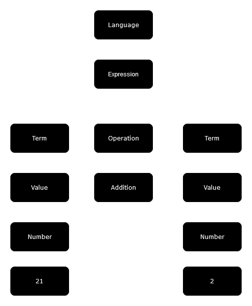

+++
title = 'Build your own language interpreter from scratch'
date = 2024-08-01T13:33:45-04:00
+++

Creating your own programming language is not hard. In fact, once you understand the basic building blocks, it can even be fun.

All programming languages, from the simplest one like Python to the incomprehensible one like C++, are built using three independent components: a lexer, a parser, and an translator.

In this post, we will cover all three of them, implement them in the Internet's favorite language du jour, Rust, and run a program written in our own language.

All code examples will also have a Rust Playground link, so you can them out as you follow along.

Without further ado, let's get started.

## Lexer

The lexer takes text and converts it to a list of tokens. A token could be a letter, a word, a number, or a punctuation mark. Tokens have meaning depending on their position in the code, but the lexer won't concern itself with syntax: it's only job is to transform text into an allowed list of symbols.

### Example

Most programming languages allow its users to do math. Let's start building our interpreter with a simple arithmetic example and write a lexer that can handle it.

_The code_

```
1 + 2
```

The job of the lexer is to transform this code into the following tokens:

```
Number(1), Plus, Number(2)
```

While you probably think that this program will add one and two together and produce `3`, the lexer is not allowed to make assumptions about syntax or execution of the code.

Since we're writing our lexer in Rust, let's define an enum that will represent all allowed tokens in our simple language:

```rust
/// List of all available tokens in our language.
#[derive(Debug)]
pub enum Token {
    Number(i64),
    Plus,
}
```

This list of tokens is short currently, but as our language evolves, it will get longer and more interesting. Our language can only add numbers at the moment, but we will add more features later, like control flow with `if` statements and `for` loops.

### Extracting tokens

At a base level, a token is a single character, like the plus sign (`+`). Our lexer will start processing the source code one character at a time.

```rust
pub struct Lexer<'a> {
    // Source code.
    source: &'a str,
    // Resulting list of tokens.
    tokens: Vec<Token>,
}

impl<'a> Lexer<'a> {
    pub fn new(source: &'a str) -> Lexer {
        Lexer {
            source,
            tokens: Vec::new(),
        }
    }

    /// Extract tokens one character at a time.
    pub fn tokens(&mut self) -> Vec<Token> {
        for c in self.source.chars() {
            todo!("extract tokens")
        }

        std::mem::take(&mut self.tokens)
    }
}
```

Since our language only supports adding numbers, our tokens can only range between the numbers `0` and `9`, and the `+` sign:

```rust
for c in self.source.chars() {
    match c {
        // Convert numbers between 0 and 9 to Rust integers.
        '0'..='9' => self.tokens.push(
            Token::Number(c.to_digit(10).unwrap() as i64)
        ),
        // Convert the plus sign to the plus token.
        '+' => self.tokens.push(Token::Plus),
        // Error out on unknown characters.
        c => todo!("lexer error, unsupported character: '{}'", c),
    }
}
```

While short, this code does quite a bit: it extracts characters from text, interprets their meaning in the context of our language, and produces values that our interpreter can understand. Since parsing text is handled by the lexer, the rest of our interpreter, namely the parser, can only work with a single enum. This separation of concerns makes compilers (and interpreters) easier to write and maintain.

Lexer code is available [here](https://play.rust-lang.org/?version=stable&mode=debug&edition=2021&gist=158b82429a9d1373db4ff54234790a01).

### Testing the lexer

Before writing any more code, we should probably write a simple test to make sure we are on the right track. I am writing this in a Rust binary project, so we can just add this to the `main` function:

```rust
fn main () {
    let source = "1 + 2";
    let mut lexer = Lexer::new(source);
    println!("{:?}", lexer.tokens());
}
```

This code compiles fine, so let's try it:

```
thread 'main' panicked at src/main.rs:38:22:
not yet implemented: lexer error, unsupported character: ' '
```

If you have done this before, you probably noticed this problem already, but for beginners this may come as a surprise: the space character (` `) is also a token which is part of the language. Therefore, the lexer needs to handle it. We do not have a use for the "space" token yet, so we will ignore it for now:

```rust
match c {
    // Ignore spaces.
    ' ' => continue,
    '0'..='9' => self.tokens.push(
        Token::Number(c.to_digit(10).unwrap() as i64)
    ),
    '+' => self.tokens.push(Token::Plus),
    c => todo!("lexer error, unsupported character: '{}'", c),
}
```

Running our lexer now with support for spaces, we are getting the right result:

```
[Number(1), Plus, Number(2)]
```

### Multi-character tokens
We are keeping our language simple for now so we can build the entire interpreter in one go, but before we continue to the parser, let's add support for multi-character numbers. Our language would be pretty silly if it could only count to 9.


Since our lexer reads the code one character at a time, and numbers can be infinitely long, we need to add a buffer to collect digits as we consume them:

```rust
pub struct Lexer<'a> {
    source: &'a str,
    tokens: Vec<Token>,

    // Buffer for multi-character tokens.
    buffer: String,
}

impl<'a> Lexer<'a> {
    /// Process a multi-character token stored in the buffer.
    fn process_token(&mut self) {
        // Empty buffer means there is nothing to do here.
        if self.buffer.is_empty() {
            return;
        }

        // Use the standard library's [`str::parse`]
        // to convert text to an integer.
        self.tokens.push(
            Token::Number(self.buffer.as_str().parse().unwrap())
        );

        // Clear the buffer for the next token.
        self.buffer.clear();
    }
}
```

Now that we handle multi-character numbers, the space character needs to be handled differently. Since space now separates tokens, instead of just ignoring it, we will process whatever is in the buffer:

```rust
for c in self.source.chars() {
    match c {
        // Spaces separate tokens.
        ' ' => self.process_token(),
        // Buffer number characters
        // instead of parsing them individually.
        '0'..='9' => self.buffer.push(c),
        '+' => self.tokens.push(Token::Plus),
        c => todo!("lexer error, unsupported character: '{}'", c),
    }
}

// Don't forget to process whatever is in the buffer
// at the end of the input:
self.process_token();
```

Let's add a bigger number to our source code and try the lexer now with actual support for numbers:

```rust
let source = "21 + 2";
```

which produces:

```
[Number(21), Plus, Number(2)]
```

This is good enough to handle our simple language. While we may be tempted to add more tokens like `if`, `for`, or `-` to support more features, let's save that for later. By building the entire interpreter first, using the right abstractions, we will be able to easily add language features later.

## Parser

The parser takes a list (sometimes called a stream) of tokens and produces an Abstract Syntax Tree. The AST, for short, is a structural representation of the code: it organizes tokens in such a way that makes sense in the context of the language rules. Constructing the AST consequently validates that the code is syntactically correct. When writing code in languages like Rust or Python, syntax errors which we are all too familiar with, are typically thrown by the parser.

Before we can build our parser, we need to get a bit more involved in our language design. By understanding a bit of theory, we can build the right abstractions early on, and make our job easier later.

### Formal definition

A formal definition is a blueprint of valid language syntax. It's only job is to ensure that tokens are presented in the correct order. It does not explain what those tokens mean or do; while the reader could infer that an `if` statement controls which part of the code is executed, the language designer could make that statement exit the program instead. Of course, that would be somewhat cruel, but the formal definition we are about to write really does not concern itself with how the interpreter chooses to execute the code.

With that somewhat disturbing knowledge hammered into our minds, let's write something:

```
language = expression
expression = term operation term | term
term = value
value = number
operation = '+'
```

Before trying to understand what this means, let's throw in some definitions:

| Term | Definition |
|------|------------|
| Language | The programming language definition. |
| Expression | Some code which, when executed, produces a single value as a result. |
| Term | A value, either constant (e.g. `21`) or variable (`source`). More on variables later. |
| Operation | An action that combines two terms into one. |
| `=` | "is a" |
| `\|` | "or a" | 

Now that we understand the lexicon a bit better, let's read our language definition one line at a time. At the top, we have:

```
language = expression
```

Our entire language is one expression. Programs written in our language can effectively contain only one line of code. A bit boring, but we will expand this later quite easily.

Moving on to the next line:

```
expression = term operation term | term
```

An expression in our language is either a binary operation on two terms, or a single term. For example, our code above is an expression of two terms joined together with a binary operator: the term on the left, `21`, is joined using the addition operator (`+`) to the right term, `2`. Alternatively, if we just typed `21` into our interpreter, by itself that expression would evaluate to `21`.

Moving on to the next line:

```
term = value
```

A term in our language is a value. This may seem redundant; why not just use `value` in the `expression` definition? Later on, we will be adding additional types of terms, like a `variable`, so it is a good idea to keep our language definition flexible.

Moving down to the next line, the `value` is expanded to a number:

```
value = number
```

Our simple language only allows numbers, but soon enough we will add strings, lists and hashes. We will be able to define operations between values of different types, e.g. addition between a list and a string, and our language will really take form.

Finally, our only allowed operation in, addition, is specified one the last line:

```
operation = '+'
```

#### Parsing our example

Now that we have formal definitions, let's parse our example manually:

```
1 + 2
```

when parsed should produce the following AST:



### Parsing expressions

Now that we have a formal definition and an AST, let's parse our example, starting at the bottom:

```rust
/// An operation. Only addition currently supported.
#[derive(Debug)]
enum Operation {
    Addition,
}

/// A constant value. Currently, only numbers are supported.
#[derive(Debug)]
enum Value {
    Number(i64),
}

/// Expression term. Currently, only values are supported.
#[derive(Debug)]
enum Term {
    Value(Value),
}
```

With the basic building blocks of our language ready, let's define an expression. If we recall the formal definition, an expression can either be a binary operation between two terms, or a just a term:

```rust
#[derive(Debug)]
enum Expression {
    /// A binary operation.
    Binary {
        left: Term,
        op: Operation,
        right: Term,
    },

    /// Just a term by itself.
    Term(Term),
}
```

That's not a lot of code given our long theoretical explanation, but that was the goal: as we understood theory, implementing the parser became easy.

### Parse tokens

Just like the lexer, a parser processes tokens one at a time. Since our language only has expressions, to have a complete language parser, we just need to implement expression parsing:

```rust
use std::iter::Iterator;

impl Expression {
    /// Given a stream of tokens, parse a single expression.
    pub fn parse(
        stream: &mut impl Iterator<Item = Token>
    ) -> Expression {
        let left = Self::term(stream);
        let operation = stream.next();

        match operation {
            Some(operation) => {
                let op = match operation {
                    Token::Plus => Operation::Addition,
                    _ => panic!(
                        "syntax error, expected operation, got: {:?}",
                        operation
                    ),
                };

                let right = Self::term(stream);

                Expression::Binary {
                    left,
                    op,
                    right,
                }
            },

            None => Expression::Term(left),
        }
    }

    /// Given a stream of tokens, parse a single term.
    fn term(
        stream: &mut impl Iterator<Item = Token>
    ) -> Term {
        let token = stream.next().expect("expected a token");

        match token {
            Token::Number(n) => Term::Value(Value::Number(n)),
            _ => panic!("syntax error, expected term, got: {:?}", token),
        }
    }
}
```

### Testing the parser

Since we have source code and a lexer already, we can add the parser to it pretty easily. Going back to our `main` function:

```rust
fn main () {
    let source = "21 + 2";
    let mut lexer = Lexer::new(source);
    let tokens = lexer.tokens();
    let expression = Expression::parse(&mut tokens.into_iter());

    println!("{:#?}", expression);
}
```

which produces:

```
Binary {
    left: Value(
        Number(
            21,
        ),
    ),
    op: Addition,
    right: Value(
        Number(
            2,
        ),
    ),
}
```

That looks about right. Let's recap. We have converted text into tokens, and parsed those tokens with our own parser, creating an Abstract Syntax Tree, validating syntax using our formal language definition. That was a lot of work just to add two numbers together, but the payoff is finally here. Let's bring our own interpreter to life and execute our AST.

Source code for the parser is [here](https://play.rust-lang.org/?version=stable&mode=debug&edition=2021&gist=047a475186aa72ad5dd080dc00355a57).

## Executor

An executor, unlike a compiler, takes the intermediary representation of the code (the AST) and executes it directly on the machine where the code is saved. A compiler, on the other hand, translates the AST into machine code, or another language, which is then executed by either another interpreter or another machine.

For example, if you are familiar with TypeScript, the TypeScript compiler translates source code into JavaScript, which is then executed by the V8 interpreter. To make things even more complicated (some would say interesting), V8 can also act as a compiler of its own, by translating JavaScript into assembly and executing it directly on the CPU. This is called JIT (Just-in-Time) compilation, a topic we could explore at some other time.

Since our language is written in Rust, our interpreter will be able to execute code on any machine where Rust is supported. This makes our language pretty flexible, since Rust can run on all Intel, AMD, and ARM CPUs, Linux, Windows and Mac. For example, another popular interpreted language, Python, is actually written in C, which makes it even more portable.

That is enough information I think. Let's get to business of executing our code.

### Evaluating expressions

Our expressions, as they currently stand, only have two variants: binary operation and a single term. Both need to have an execution path defined, so let's handle them both in one simple function:

```rust
impl Expression {
    pub fn evaluate(&self) -> Value {
        match self {
            Expression::Term(Term::Value(value)) => value.clone(),
            Expression::Binary {
                left: Term::Value(left),
                op,
                right: Term::Value(right)
            } => {
                match op {
                    Operation::Addition => left.clone() + right.clone(),
                }
            },
        }
    }
}
```

Looking back at our formal definition, an expression is some code that, when executed, returns a single value. So, the `evaluate` method here takes an expression and has to return a `Value`. The first kind of expression, a single term, is easy to execute: it just returns whatever value it is holding.

The binary operation is only slightly more involved. To evaluate it, we take the left side and join it with the right side using the specified operation. Since we currently support only addition, the operation we are implementing is simple: we add the two values together.

Compiling this code, we get a couple errors:

```
value.clone(),
^^^^^^^^^^^^^ expected `Value`, found `&Value

note: `Value` does not implement `Clone`, so `&Value` was cloned instead
```

and

```
cannot add `Value` to `Value`

note: an implementation of `Add` might be missing for `Value`
```

The first one is easy to fix. Let's add a `Clone` implementation to our `Value` enum:

```rust
#[derive(Debug, Clone)]
enum Value {
    Number(i64),
}
```

The second error asks us to explain to the Rust compiler how to add two `Value` enums together. The idiomatic way to do this in Rust is to implement the `std::ops::Add` trait, which we can do as follows:

```rust
use std::ops::Add;

impl Add for Value {
    type Output = Value;

    fn add(self, other: Value) -> Value {
        match (self, other) {
            (Value::Number(a), Value::Number(b)) => Value::Number(a + b),
        }
    }
}
```

Going back to our `main` function, let's evaluate our example:

```rust
fn main () {
    let source = "21 + 2";

    // Parse the code into tokens.
    let mut lexer = Lexer::new(source);
    let tokens = lexer.tokens();

    // Parse the tokens into an AST.
    let expression = Expression::parse(&mut tokens.into_iter());

    // Execute the AST producing a single value.
    let result = expression.evaluate();

    println!("{:?}", result);
}
```

Running our interpreter, we finally get:

```
Number(23)
```

That was quite a journey, but we are finally here. With only 175 lines of code, we managed to read text and add two numbers together. Talk about doing things the hard way, but it is definitely more fun and informative than just typing them into a Google search field.

Source code is available [here](https://play.rust-lang.org/?version=stable&mode=debug&edition=2021&gist=8c50fd21a8b49b92005addc503bf22e6).

## Quick recap

Before going further, let's do a quick recap.

First, we built a lexer, which takes text and converts it to a list of predefined tokens.  Second, we wrote a parser which takes that list and converts it to an Abstract Syntax Tree. The parser validates language syntax, and creates an intermediary representation of the source code.

Lastly, we wrote an executor that takes the AST and executes it to produce a single value. Our executor is written in Rust, so it can run our code on any machine supported by the Rust compiler.

This was great and all, but it is hard to see why this was necessary. Well, let's shake things up and add support for strings.

## Adding strings

A string is a sequence of characters, which when interpreted, is represented as a value. For example, `"hello world"` is a string. How our language represents strings is completely up to us, and as the language designer you get to decide how you want this to work. For example, strings in C are placed between double quotes. Python, on the other hand, allows single, double, and even triple single or double quotes:

- `'this is a string'`
- `"this is also a string"`
- `'''this is a multi-line string'''`
- `"""this is also a multi-line string"""`

To support strings, we will need to make modifications at all 3 levels of our interpreter. We need to add support for parsing strings to the lexer, for representing strings in the AST in the parser, and finally executing operations on strings in the executor.

### Lexer

The lexer gets to decide how strings are represented in code. Our lexer will follow the C string convention and only allow strings between double quotes. First, let's modify our lexicon to add a string token:

```rust
#[derive(Debug)]
pub enum Token {
    Number(i64),
    Plus,
    String(String),
}
```

With that small modification out of the way, let's modify the lexer `tokens` method slightly to handle parsing strings:

```rust
impl<'a> Lexer {
    pub fn tokens(&mut self) -> Vec<Token> {
        // Create an iterator over the source code,
        // one character at a time.
        let mut chars = self.source.chars();

        while let Some(c) = chars.next() {
            match c {
                ' ' => self.process_token(),
                '0'..='9' => self.buffer.push(c),
                '+' => self.tokens.push(Token::Plus),

                // Double quote indicating the start of a string.
                '"' => {
                    let mut string = String::new();

                    // Consume from the same iterator,
                    // moving the lexer forward in the text stream.
                    while let Some(c) = chars.next() {
                        match c {
                            // Closing double quote ends the string.
                            '"' => break,
                            _ => string.push(c),
                        }
                    }

                    self.tokens.push(Token::String(string));
                }

                c => todo!("lexer error, unsupported character: '{}'", c),
            }
        }

        // Don't forget to process whatever is in the buffer.
        self.process_token();

        // Return the list of tokens, emptying the lexer.
        std::mem::take(&mut self.tokens)
    }
}
```

Looks good enough for now, let's test it with a modification to our `main` function. I'm removing code that parses and evaluates this expression for now, since we haven't added support for strings into the parser yet:

```rust
fn main () {
    let source = r#"21 + "hello world" + 2"#;

    // Parse the code into tokens.
    let mut lexer = Lexer::new(source);
    let tokens = lexer.tokens();
    
    println!("{:?}", tokens);
}
```

which produces:

```
[Number(21), Plus, String("hello world"), Plus, Number(2)]
```

While this may not make much sense yet in the context of our language, the lexer does not care and produces a valid list of tokens. Good stuff, let's add the string into our Abstract Syntax Tree.

### Parser

The parser operates with values, so we need to add a string value to our `Value` enum first:

```rust
#[derive(Debug, Clone)]
enum Value {
    Number(i64),
    /// A value storing a string.
    String(String),
}
```

Compiling this will quickly produce an error since the `Value` enum is used inside the `std::ops::Add` trait implementation. Let's add a `todo` there for now, we are not sure yet what operations we want to support on strings:

```rust
impl Add for Value {
    type Output = Value;

    fn add(self, other: Value) -> Value {
        match (self, other) {
            (Value::Number(a), Value::Number(b)) => Value::Number(a + b),
            (a, b) => todo!(
                "syntax error, '+' between {:?} and {:?} not supported",
                a, b
            ),
        }
    }
}
```

which now compiles, but if you attempt to parse this expression, you will still get a syntax error. Let's continue modifying the parser, and add support for parsing the `Token::String` token. `"hello world"` is a term, just like a number, so modifying term parsing should do the trick:

```rust
impl Expression {
    fn term(stream: &mut impl Iterator<Item = Token>) -> Term {
        let token = stream.next().expect("expected a token");

        match token {
            Token::Number(n) => Term::Value(Value::Number(n)),
            Token::String(s) => Term::Value(Value::String(s)),
            _ => panic!("syntax error, expected term, got: {:?}", token),
        }
    }
}
```

Adding back parsing to `main`:

```rust
fn main () {
    let source = r#"21 + "hello world""#;

    // Parse the code into tokens.
    let mut lexer = Lexer::new(source);
    let tokens = lexer.tokens();

    // Parse the tokens into an AST.
    let expression = Expression::parse(&mut tokens.into_iter());

    println!("{:#?}", expression);

    // Execute the AST producing a single value.
    let result = expression.evaluate();

    println!("{:?}", result);
}
```

we get:

```
Binary {
    left: Value(
        Number(
            21,
        ),
    ),
    op: Addition,
    right: Value(
        String(
            "hello world",
        ),
    ),
}

thread 'main' panicked at src/main.rs:101:23:

not yet implemented:

syntax error, addition between Number(21)
and String("hello world") not supported
```

Very cool, our parser can now build Abstract Syntax Trees which contain string tokens. You will note I removed the leftmost term (`+ 2`) from the expression. Our parser can only parse expressions with two terms currently. We will add support for unlimited terms later on, and that is when all these abstractions will really worthwhile.

That being said, our interpreter is still not working. That is expected; we have not added support for string-based operations yet. This is where our language can become unique and interesting.

### Syntactic sugar

Open up a Python interpreter and try running our code as is:

```python
21 + "hello world"
```

You will get this error:

```
TypeError: unsupported operand type(s) for +: 'int' and 'str'
```

That makes sense for Python, but what if we wanted to support this operation in our language, what would we make it do? Instead of throwing a syntax error, we could conceivably just convert the number to a string and concatenate the two together. Python forces you to write this out explicitly, e.g. `str(21) + "hello world"`, but we could do this automatically.

Doing an operation automatically because it is the most common and desired outcome is called "syntactic sugar". The language designer makes it easy for language users to write code by executing some implied operations automatically. Going back to Python, if you run:

```python
"hello" * 3
```

you will get a valid result:

```
"hellohellohello"
```

So the syntactic sugar for string multiplication by a number is available. We will add this to our language as well, but let's start with the basics first.

Going back to our syntax error, let's add support for string and number concatenation:

```rust
impl Add for Value {
    type Output = Value;

    fn add(self, other: Value) -> Value {
        match (self, other) {
            (Value::Number(a), Value::Number(b)) => Value::Number(a + b),

            // Supports 21 + "hello world"
            (
                Value::Number(a),
                Value::String(s),
            ) => Value::String(a.to_string() + &s),

            // Supports "hello world" + 21
            (
                Value::String(s),
                Value::Number(a),
            ) => Value::String(s + a.to_string().as_str()),

            (a, b) => todo!(
                "syntax error, '+' between {:?} and {:?} not supported",
                a, b
            ),
        }
    }
}
```

Running our interpreter now, we get:

```
String("21hello world")
```

Now we are cooking with gas! Our language has a feature some other language does not, and we have implemented it from scratch in Rust. Source code available [here](https://play.rust-lang.org/?version=stable&mode=debug&edition=2021&gist=b2cf0b7d4b5d72dc060f096404014753).

Last but not least, let's update our language formal definition to include the change we just made:

```
value = number | string
```